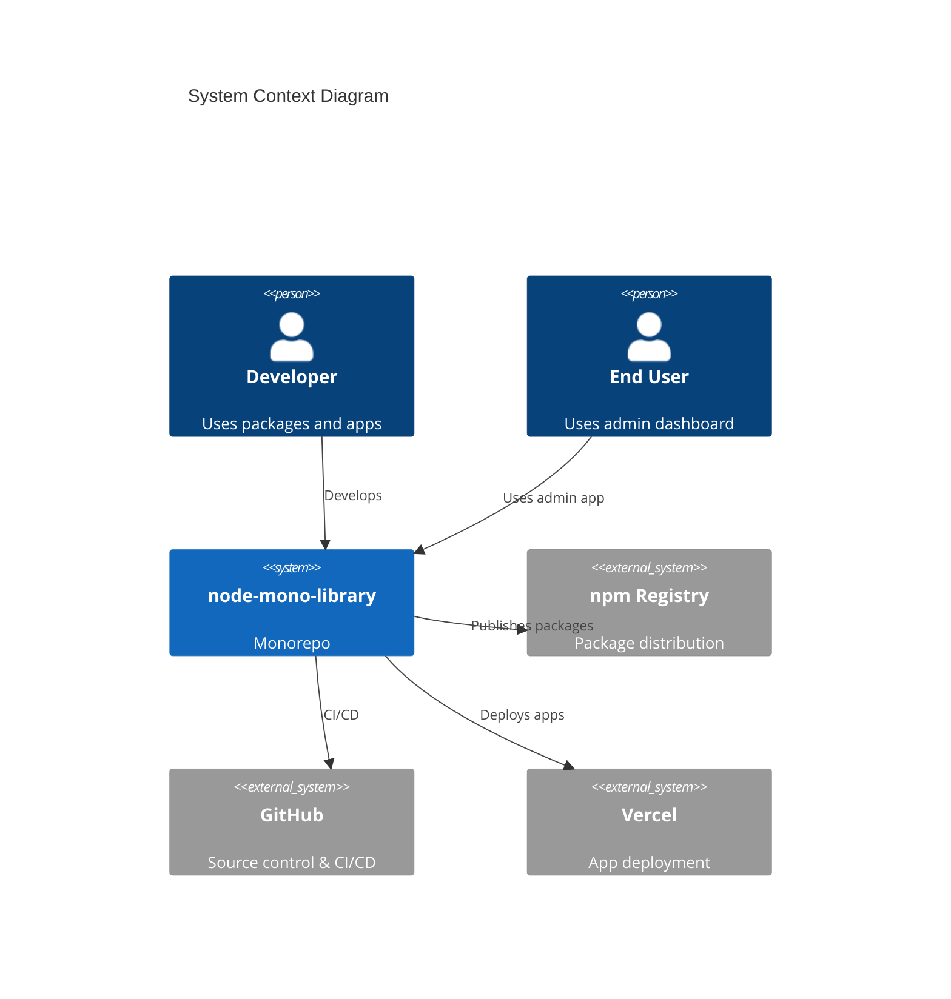
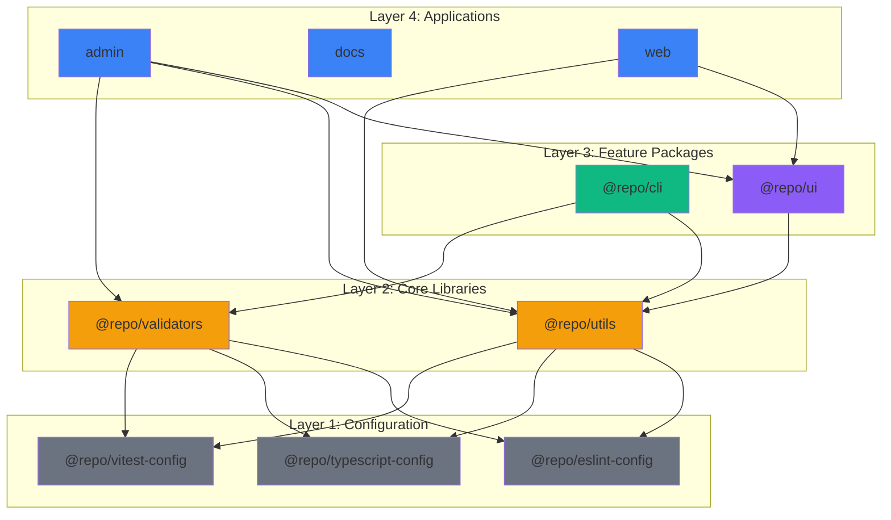
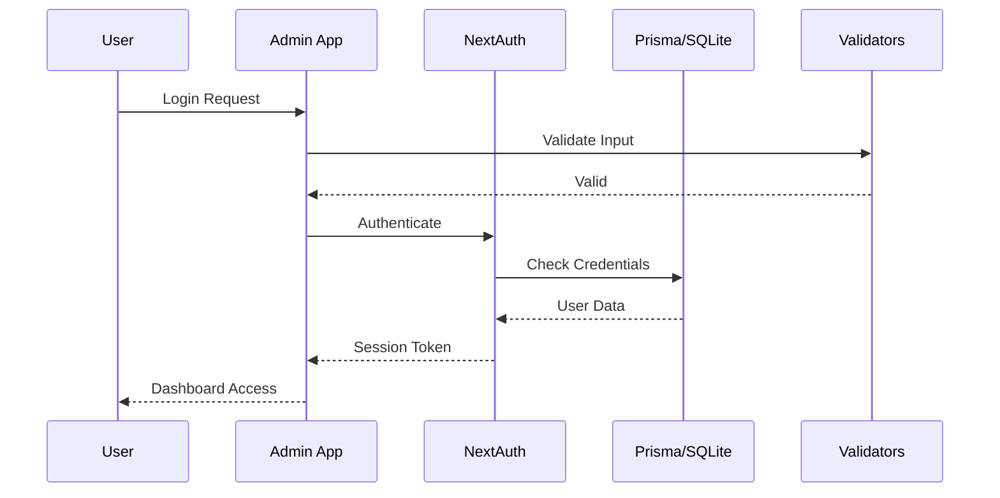
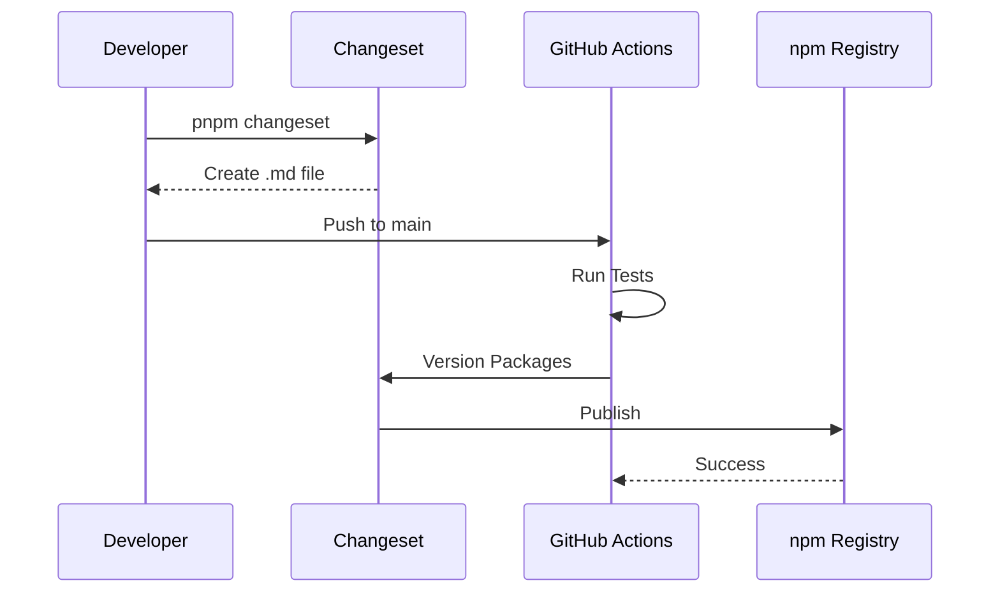
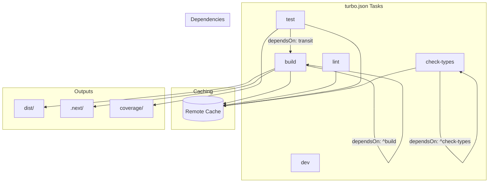
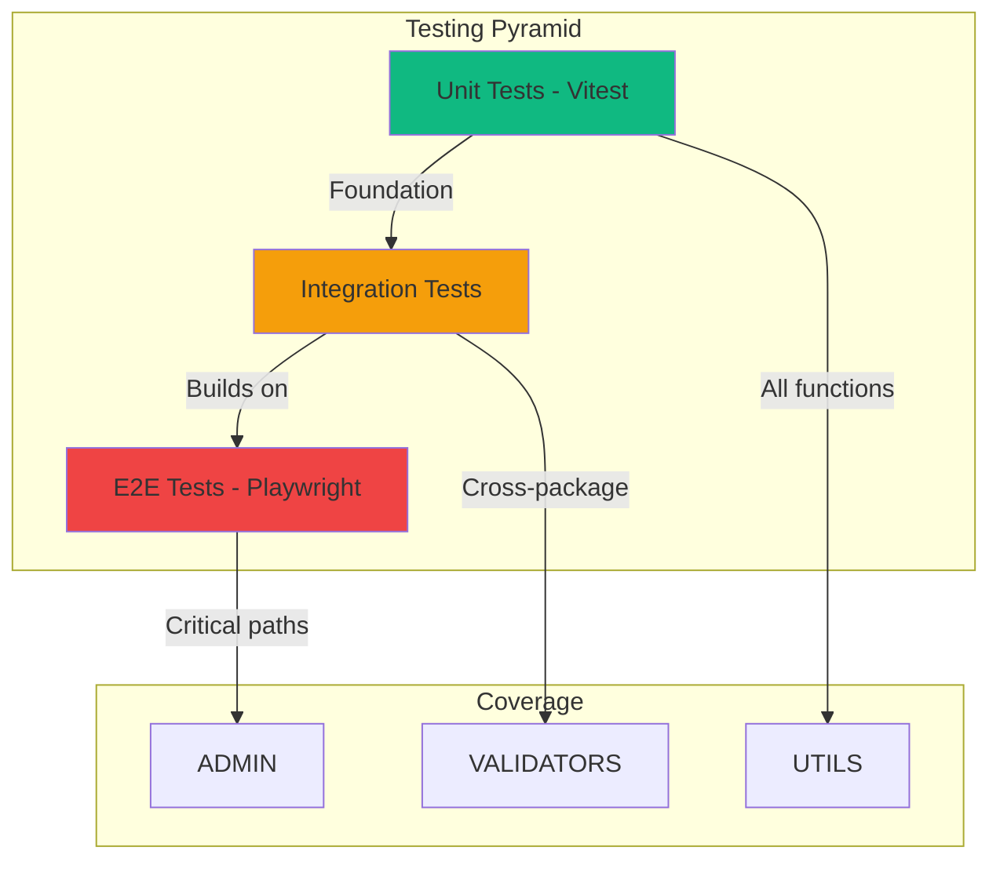
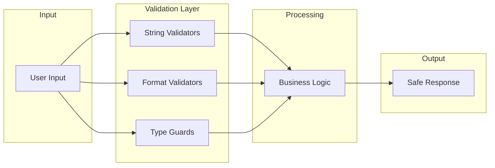
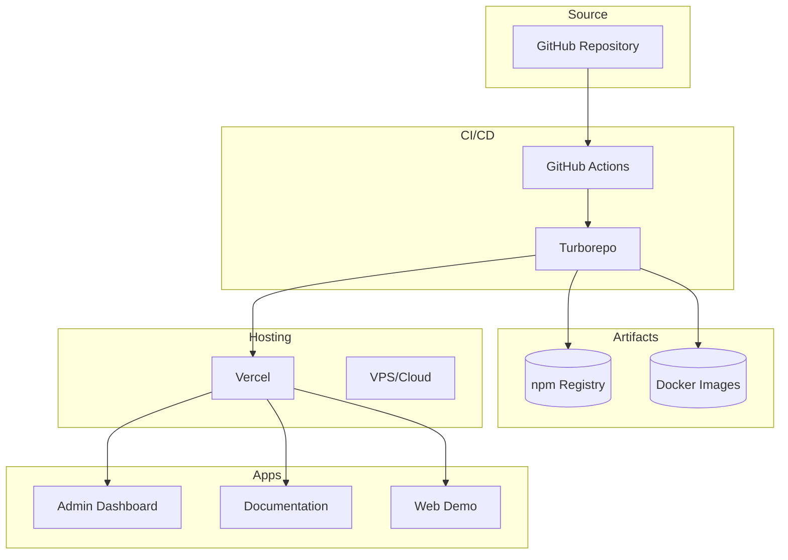
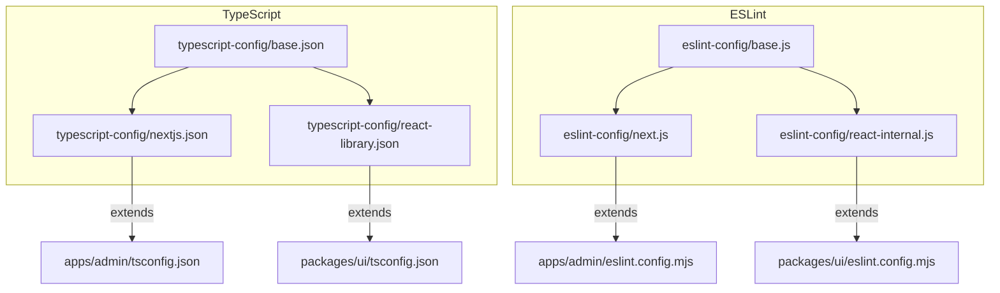

# Architecture Guide

Technical deep-dive into the node-mono-library architecture.

## System Architecture

## Package Architecture

### Layered Dependencies

## Data Flow

### Admin Dashboard

### Package Publishing

## Build System

### Turborepo Pipeline

### Build Optimization

| Feature            | Implementation          | Benefit              |
| ------------------ | ----------------------- | -------------------- |
| Task Caching       | Turborepo hash-based    | Skip unchanged work  |
| Parallel Execution | Turborepo orchestration | Faster builds        |
| Incremental Builds | TypeScript incremental  | Faster type checking |
| Tree Shaking       | tsup/esbuild            | Smaller bundles      |
| Code Splitting     | Next.js automatic       | Faster page loads    |

## Testing Strategy

## Security Model

## Deployment Architecture

## Configuration Inheritance

## Module Resolution

### Package Exports

```mermaid
graph LR
    subgraph "@repo/utils"
        INDEX[index.ts]
        STRING[string.ts]
        ARRAY[array.ts]
        OBJECT[object.ts]
        ASYNC[async.ts]
    end

    subgraph "Consumers"
        IMPORT1["import { capitalize } from '@repo/utils/string'"]
        IMPORT2["import * as utils from '@repo/utils'"]
    end

    IMPORT1 --> STRING
    IMPORT2 --> INDEX
    INDEX --> STRING
    INDEX --> ARRAY
    INDEX --> OBJECT
    INDEX --> ASYNC
```

## Performance Considerations

| Area     | Strategy        | Implementation         |
| -------- | --------------- | ---------------------- |
| Build    | Caching         | Turborepo remote cache |
| Dev      | Hot Reload      | Next.js Fast Refresh   |
| Bundle   | Tree Shaking    | tsup + esbuild         |
| Runtime  | Lazy Loading    | Dynamic imports        |
| Database | Connection Pool | Prisma                 |
| Testing  | Parallel        | Vitest threads         |

---

_See [PROJECT_OVERVIEW.md](PROJECT_OVERVIEW.md) for a quick visual reference._
