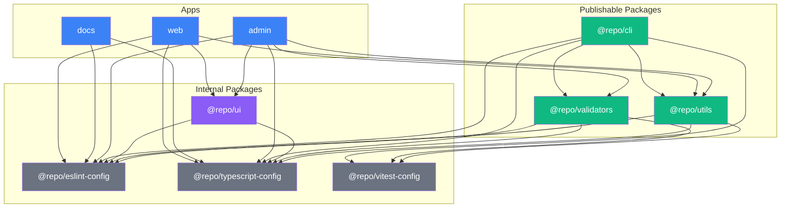
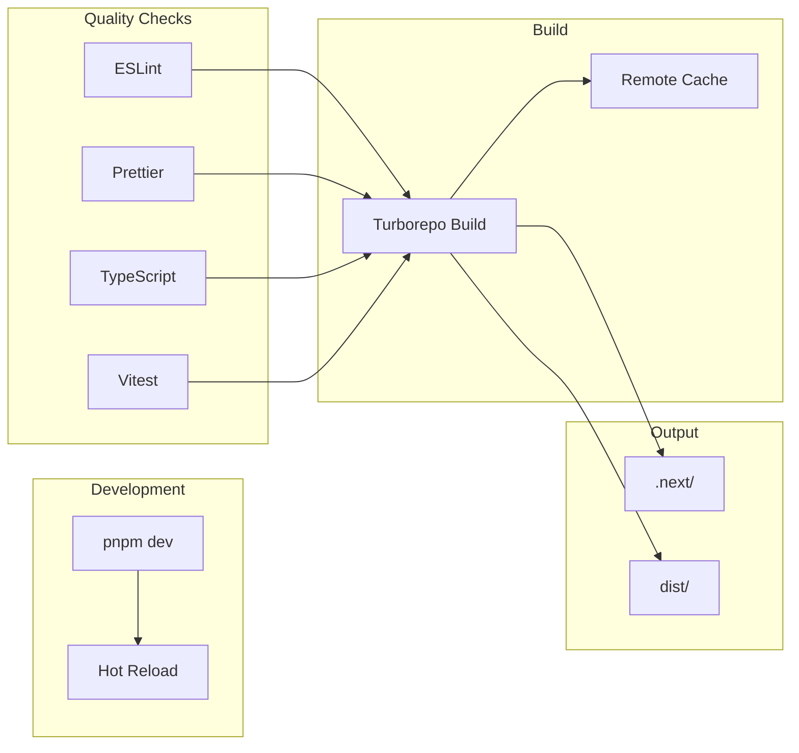
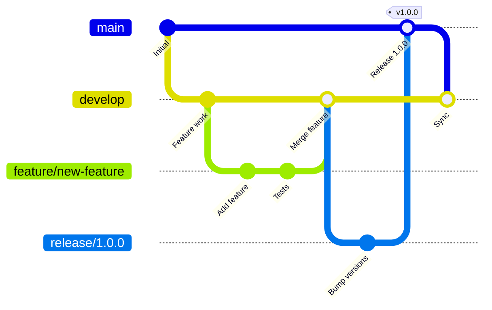
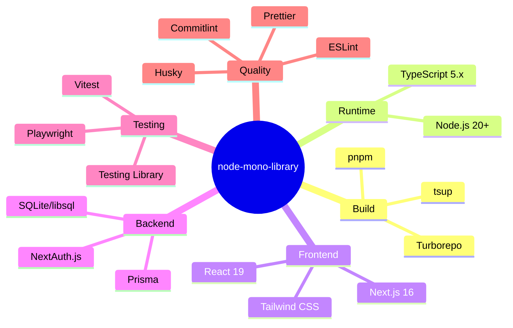

# Project Overview

A visual guide to the node-mono-library architecture and structure.

## 📊 Repository Structure

```text
node-mono-library/
├── apps/                    # Deployable applications
│   ├── admin/              # Admin dashboard (Next.js 16 + Prisma)
│   ├── docs/               # Documentation site (Next.js)
│   └── web/                # Demo web app (Next.js)
│
├── packages/               # Shared libraries
│   ├── cli/               # CLI tool (@repo/cli) - publishable
│   ├── utils/             # Utility functions (@repo/utils) - publishable
│   ├── validators/        # Validation library (@repo/validators) - publishable
│   ├── ui/                # React components (@repo/ui)
│   ├── eslint-config/     # Shared ESLint config
│   ├── typescript-config/ # Shared TS config
│   └── vitest-config/     # Shared test config
│
├── examples/              # Usage examples
│   └── demo-app/         # Example app using packages
│
├── tests/                 # E2E tests (Playwright)
│   └── e2e/
│
├── docs/                  # Project documentation
└── scripts/               # Build & packaging scripts
```

## 🔗 Package Dependency Graph



## 🏗️ Build Pipeline



## 🔄 Git Workflow



## 📦 Package Types

| Type          | Packages                                        | Purpose                 | Published |
| ------------- | ----------------------------------------------- | ----------------------- | --------- |
| **Apps**      | admin, docs, web                                | Deployable applications | No        |
| **Libraries** | utils, validators, cli                          | Reusable functionality  | Yes (npm) |
| **UI**        | ui                                              | React components        | No        |
| **Config**    | eslint-config, typescript-config, vitest-config | Shared configurations   | No        |

## 🛠️ Technology Stack



## 📁 Key Files

| File                     | Purpose                       |
| ------------------------ | ----------------------------- |
| `turbo.json`             | Turborepo task configuration  |
| `pnpm-workspace.yaml`    | Workspace package definitions |
| `package.json`           | Root scripts and dependencies |
| `.changeset/config.json` | Version management config     |
| `playwright.config.ts`   | E2E test configuration        |
| `eslint.config.mjs`      | Root ESLint configuration     |

## 🚀 Quick Commands

```bash
# Development
pnpm dev              # Start all apps
pnpm dev --filter=admin  # Start specific app

# Quality
pnpm validate         # Full validation suite
pnpm lint            # Lint all packages
pnpm test            # Run all tests

# Build
pnpm build           # Build all packages
pnpm build --filter=@repo/utils  # Build specific

# Release
pnpm changeset       # Create changeset
pnpm release         # Full release flow
```

## 📚 Documentation Index

| Document                                      | Description           |
| --------------------------------------------- | --------------------- |
| [README.md](../README.md)                     | Project introduction  |
| [CONTRIBUTING.md](../.github/CONTRIBUTING.md) | Contribution guide    |
| [TESTING.md](TESTING.md)                      | Testing strategies    |
| [VERSIONING.md](VERSIONING.md)                | Version management    |
| [ADDING-PROJECTS.md](ADDING-PROJECTS.md)      | Creating new packages |
| [RELEASE_SECRETS.md](RELEASE_SECRETS.md)      | CI/CD secrets setup   |

## 🔍 Package Details

### @repo/utils

String, array, object, and async utility functions.

```typescript
import { capitalize } from "@repo/utils/string";
import { unique } from "@repo/utils/array";
import { deepClone } from "@repo/utils/object";
import { retry } from "@repo/utils/async";
```

### @repo/validators

Type-safe validation functions.

```typescript
import { isEmail } from "@repo/validators/format";
import { isInRange } from "@repo/validators/number";
import { isEmpty } from "@repo/validators/string";
import { isValidDate } from "@repo/validators/date";
```

### @repo/cli

Command-line tool for project scaffolding and utilities.

```bash
repo-cli init          # Initialize project
repo-cli generate      # Generate code
repo-cli validate      # Validate project
```

---

_Generated for node-mono-library. Run `pnpm docs:generate` to regenerate._
